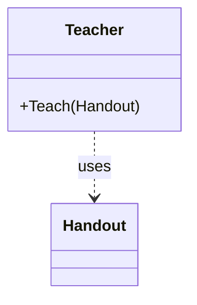
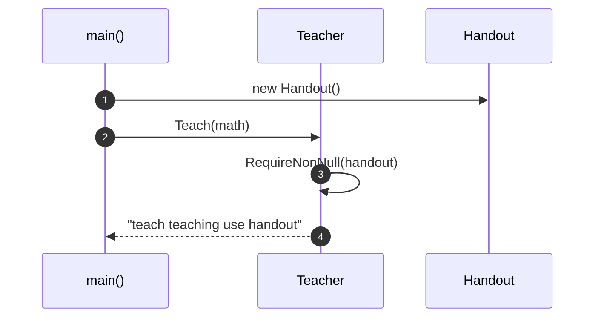

# OOA_Training / 1 — Teacher uses Handout

> **Concept:** Dependency — `Teacher` only uses a `Handout` as a parameter; it does not keep a reference.

## Class Diagram

```mermaid
classDiagram
    class Teacher {
        +Teach(Handout)
    }
    class Handout
    Teacher ..> Handout : uses
```

## Sequence Diagram

```mermaid
sequenceDiagram
    autonumber
    participant Main as main()
    participant T as Teacher
    participant H as Handout
    Main->>H: new Handout()
    Main->>T: Teach(math)
    T->>T: RequireNonNull(handout)
    T-->>Main: "teach teaching use handout"
```
