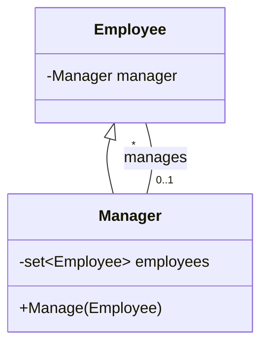
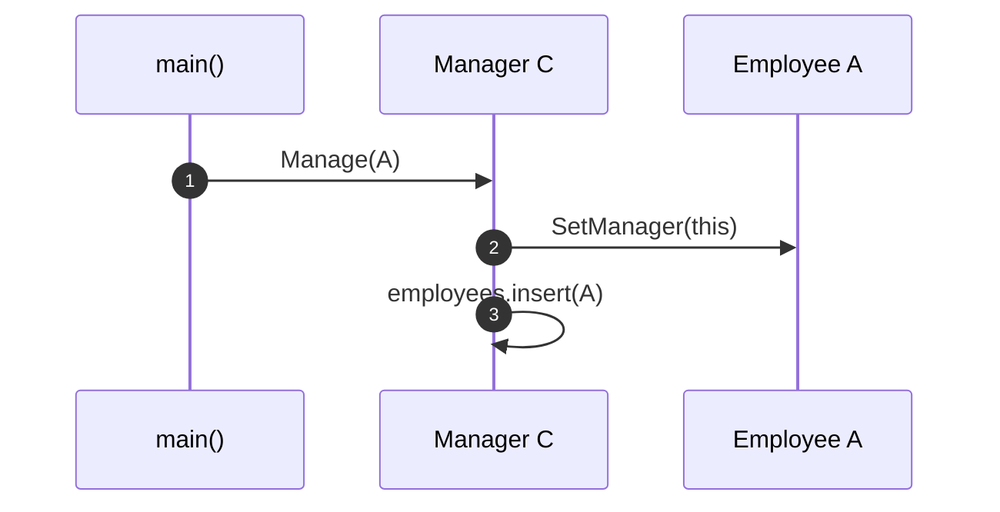

# OOA_Training / 10 — Manager and Employee

> **Concept:** Inheritance + reflexive one-to-many — a `Manager` is an `Employee` and manages other employees.

## Class Diagram

```mermaid
classDiagram
    class Employee {
        -Manager manager
    }
    class Manager {
        -set~Employee~ employees
        +Manage(Employee)
    }
    Employee <|-- Manager
    Manager "0..1" -- "*" Employee : manages
```

## Sequence Diagram

```mermaid
sequenceDiagram
    autonumber
    participant Main as main()
    participant M as Manager C
    participant E as Employee A
    Main->>M: Manage(A)
    M->>E: SetManager(this)
    M->>M: employees.insert(A)
```
