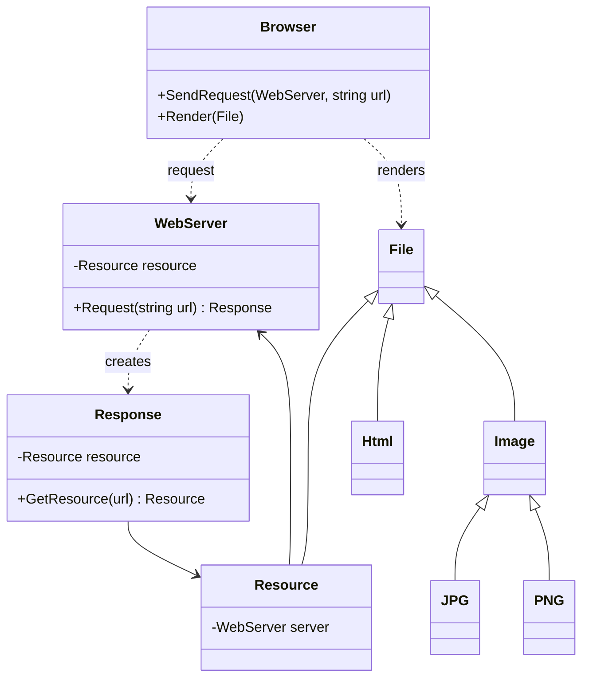
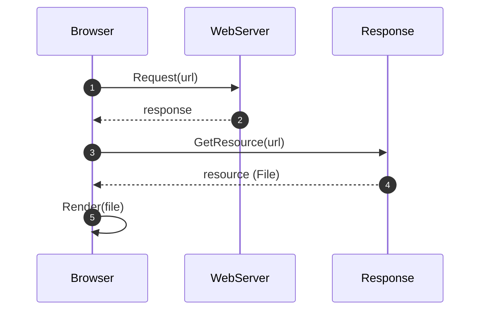

# OOA_Training / 15 — Browser and WebServer

> **Concept:** Deeper inheritance hierarchy + request/response collaboration. (Model only; `main()` is empty.)

## Class Diagram

```mermaid
classDiagram
    class Browser {
        +SendRequest(WebServer, string url)
        +Render(File)
    }
    class WebServer {
        -Resource resource
        +Request(string url) Response
    }
    class Response {
        -Resource resource
        +GetResource(url) Resource
    }
    class File
    class Resource {
        -WebServer server
    }
    class Html
    class Image
    class JPG
    class PNG
    File <|-- Resource
    File <|-- Html
    File <|-- Image
    Image <|-- JPG
    Image <|-- PNG
    Browser ..> WebServer : request
    WebServer ..> Response : creates
    Response --> Resource
    Resource --> WebServer
    Browser ..> File : renders
```

## Sequence Diagram

```mermaid
sequenceDiagram
    autonumber
    participant B as Browser
    participant WS as WebServer
    participant R as Response
    B->>WS: Request(url)
    WS-->>B: response
    B->>R: GetResource(url)
    R-->>B: resource (File)
    B->>B: Render(file)
```
