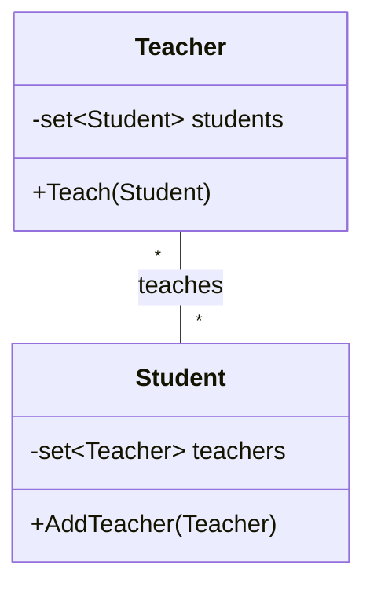
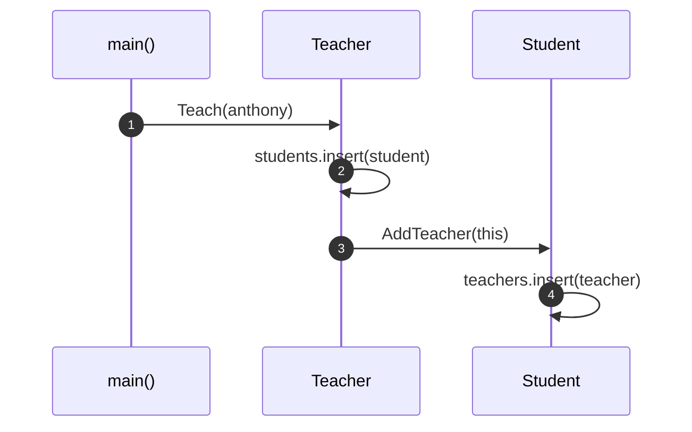

# OOA_Training / 2 — Teacher ↔ Student

> **Concept:** Bidirectional many-to-many association — both sides keep a `std::set` of the other.

## Class Diagram

```mermaid
classDiagram
    class Teacher {
        -set~Student~ students
        +Teach(Student)
    }
    class Student {
        -set~Teacher~ teachers
        +AddTeacher(Teacher)
    }
    Teacher "*" -- "*" Student : teaches
```

## Sequence Diagram

```mermaid
sequenceDiagram
    autonumber
    participant Main as main()
    participant T as Teacher
    participant S as Student
    Main->>T: Teach(anthony)
    T->>T: students.insert(student)
    T->>S: AddTeacher(this)
    S->>S: teachers.insert(teacher)
```
