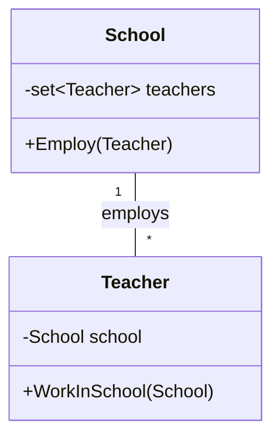
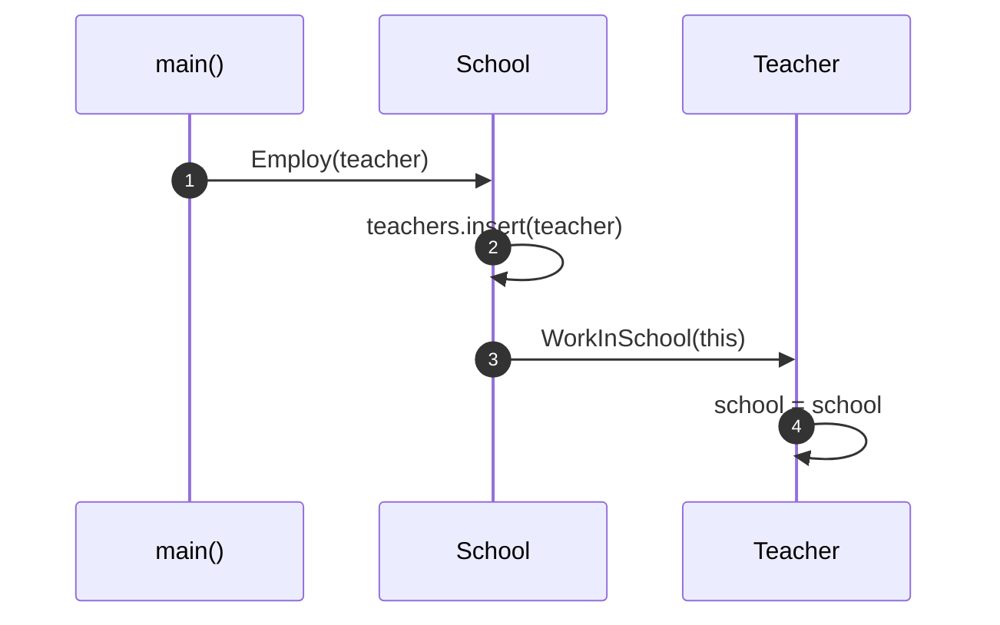

# OOA_Training / 3 — School employs Teacher

> **Concept:** Bidirectional one-to-many — the school keeps all teachers, each teacher knows its school.

## Class Diagram

```mermaid
classDiagram
    class School {
        -set~Teacher~ teachers
        +Employ(Teacher)
    }
    class Teacher {
        -School school
        +WorkInSchool(School)
    }
    School "1" -- "*" Teacher : employs
```

## Sequence Diagram

```mermaid
sequenceDiagram
    autonumber
    participant Main as main()
    participant Sc as School
    participant T as Teacher
    Main->>Sc: Employ(teacher)
    Sc->>Sc: teachers.insert(teacher)
    Sc->>T: WorkInSchool(this)
    T->>T: school = school
```
