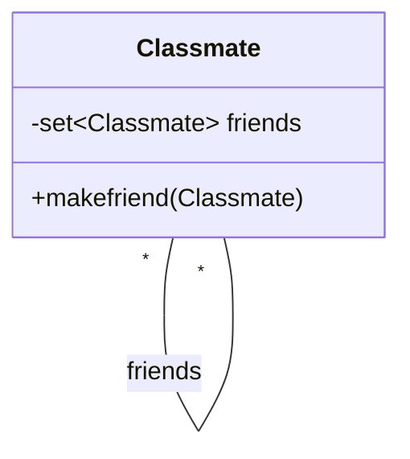
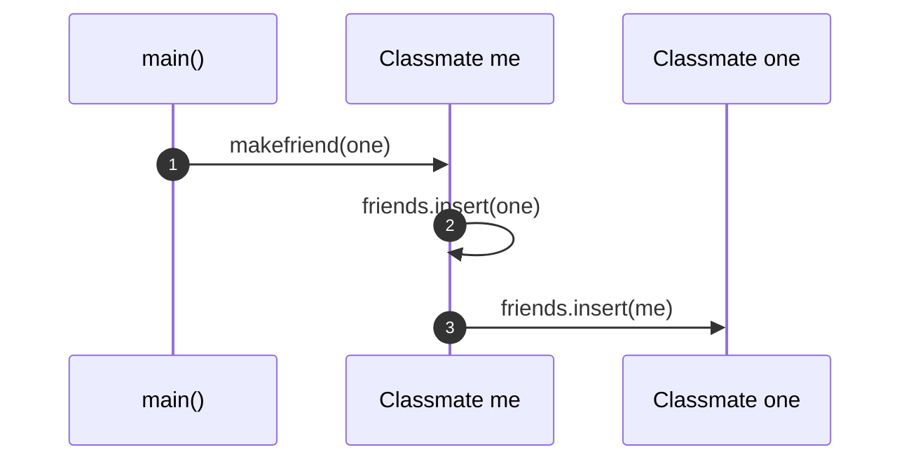

# OOA_Training / 7 — Classmate friends

> **Concept:** Reflexive (self) association — a `Classmate` is friends with other `Classmate`s, kept on both sides.

## Class Diagram

```mermaid
classDiagram
    class Classmate {
        -set~Classmate~ friends
        +makefriend(Classmate)
    }
    Classmate "*" -- "*" Classmate : friends
```

## Sequence Diagram

```mermaid
sequenceDiagram
    autonumber
    participant Main as main()
    participant Me as Classmate me
    participant One as Classmate one
    Main->>Me: makefriend(one)
    Me->>Me: friends.insert(one)
    Me->>One: friends.insert(me)
```
