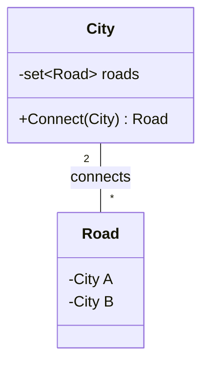
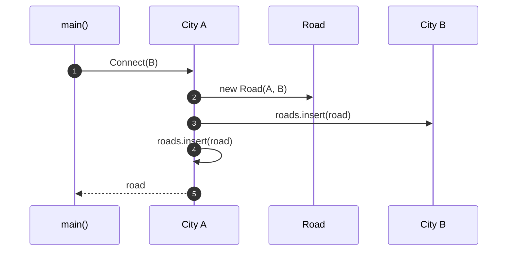

# OOA_Training / 9 — City and Road

> **Concept:** Graph-like association — a `Road` connects exactly two `City` objects; each city keeps its roads.

## Class Diagram

```mermaid
classDiagram
    class City {
        -set~Road~ roads
        +Connect(City) Road
    }
    class Road {
        -City A
        -City B
    }
    City "2" -- "*" Road : connects
```

## Sequence Diagram

```mermaid
sequenceDiagram
    autonumber
    participant Main as main()
    participant A as City A
    participant R as Road
    participant B as City B
    Main->>A: Connect(B)
    A->>R: new Road(A, B)
    A->>B: roads.insert(road)
    A->>A: roads.insert(road)
    A-->>Main: road
```
