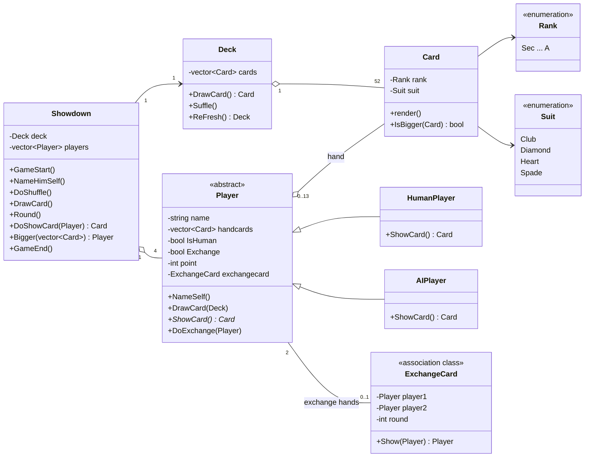
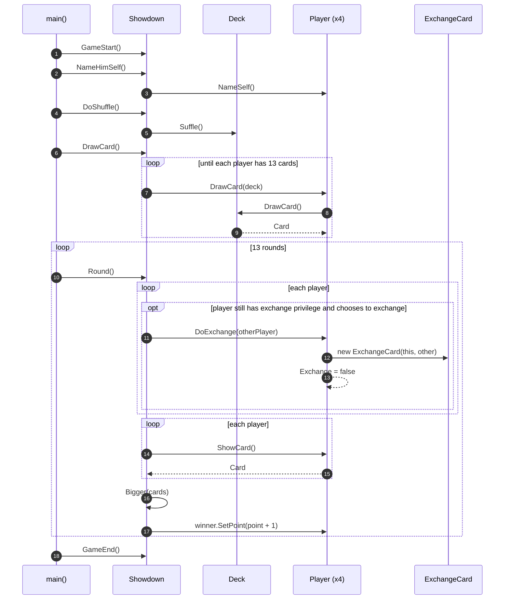

# ShowDown — Diagrams

> **Focus:** OOA (association class, abstract player)

## Class Diagram

```mermaid
classDiagram
    direction LR
    class Showdown {
        -Deck deck
        -vector~Player~ players
        +GameStart()
        +NameHimSelf()
        +DoShuffle()
        +DrawCard()
        +Round()
        +DoShowCard(Player) Card
        +Bigger(vector~Card~) Player
        +GameEnd()
    }
    class Deck {
        -vector~Card~ cards
        +DrawCard() Card
        +Suffle()
        +ReFresh() Deck
    }
    class Card {
        -Rank rank
        -Suit suit
        +render()
        +IsBigger(Card) bool
    }
    class Player {
        <<abstract>>
        -string name
        -vector~Card~ handcards
        -bool IsHuman
        -bool Exchange
        -int point
        -ExchangeCard exchangecard
        +NameSelf()
        +DrawCard(Deck)
        +ShowCard()* Card
        +DoExchange(Player)
    }
    class HumanPlayer {
        +ShowCard() Card
    }
    class AIPlayer {
        +ShowCard() Card
    }
    class ExchangeCard {
        <<association class>>
        -Player player1
        -Player player2
        -int round
        +Show(Player) Player
    }
    class Rank {
        <<enumeration>>
        Sec ... A
    }
    class Suit {
        <<enumeration>>
        Club
        Diamond
        Heart
        Spade
    }

    Showdown "1" o-- "4" Player
    Showdown "1" --> "1" Deck
    Deck "1" o-- "52" Card
    Card --> Rank
    Card --> Suit
    Player <|-- HumanPlayer
    Player <|-- AIPlayer
    Player "0..13" o-- Card : hand
    Player "2" -- "0..1" ExchangeCard : exchange hands
```

## Sequence Diagram — one game

```mermaid
sequenceDiagram
    autonumber
    participant Main as main()
    participant S as Showdown
    participant D as Deck
    participant P as Player (x4)
    participant E as ExchangeCard

    Main->>S: GameStart()
    Main->>S: NameHimSelf()
    S->>P: NameSelf()
    Main->>S: DoShuffle()
    S->>D: Suffle()
    Main->>S: DrawCard()
    loop until each player has 13 cards
        S->>P: DrawCard(deck)
        P->>D: DrawCard()
        D-->>P: Card
    end
    loop 13 rounds
        Main->>S: Round()
        loop each player
            opt player still has exchange privilege and chooses to exchange
                S->>P: DoExchange(otherPlayer)
                P->>E: new ExchangeCard(this, other)
                P-->>P: Exchange = false
            end
        end
        loop each player
            S->>P: ShowCard()
            P-->>S: Card
        end
        S->>S: Bigger(cards)
        S->>P: winner.SetPoint(point + 1)
    end
    Main->>S: GameEnd()
```
